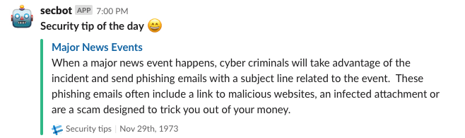

# Security Tip of the Day - Slackbot

Building security into company culture is necessary but not always easy. In many cases
employees are the first line of defense against attacks.

"Security Tip of the Day" Slackbot leverages an RSS feed from [SANS](http://feeds2.feedburner.com/security-awareness-tip-of-the-day).
On each business day the Bot posts Security Awareness Tip of the Day to Slack channel of choice. Tips are meant to
provide security related advises that can be applied both to work and personal online activities.

## Requirements

* Slack
    * [Slack App](https://api.slack.com/slack-apps) 
    * Slack Channel
    * Slack Token 
* Virtualenv
    * Create: `python3 -m venv ${PATH_TO_VENV}`
    * Activate: `. ${PATH_TO_VENV/bin/activate`
* Install requirements
    * `pip install -r requirements.txt`
* Configure environment variables
    * Set `SLACK_BOT_TOKEN` environment variable
    * Set `SLACK_CHANNEL` environment variable

## Message Format

Example message



---
##  Deployment

The bot can be deployed as a crontab to run daily. 

```
  0 9 * * *  command to execute
  │ │ │ │ │
  │ │ │ │ │
  │ │ │ │ └───── day of week (0 - 6) (0 to 6 are Sunday to Saturday, or use names; 7 is Sunday, the same as 0)
  │ │ │ └────────── month (1 - 12)
  │ │ └─────────────── day of month (1 - 31)
  │ └──────────────────── hour (0 - 23)
  └───────────────────────── min (0 - 59)
```

## Contributors

* [marcoangulo](https://github.com/marcoangulo)
